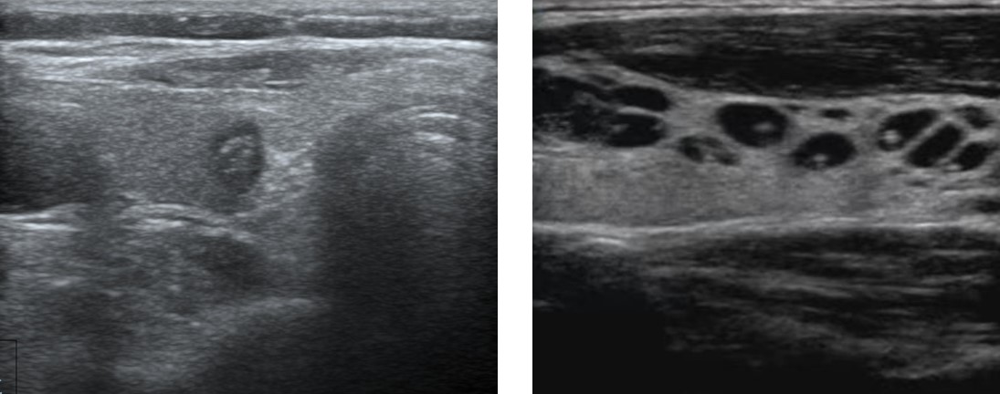
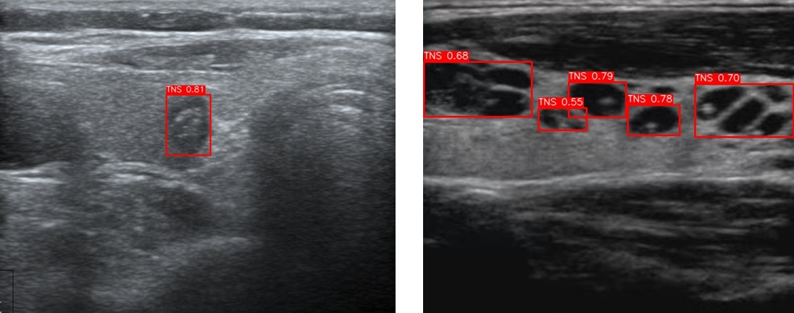

# Thyroid-nodule detection


# 🩺 YOLO-Based Thyroid Lesion Detection

## 🩺 Model Description

This detection model is specifically designed for **thyroid nodule detection** in ultrasound images.  
Thyroid nodules (lesions) are common findings in clinical ultrasound examination, and accurate detection is essential for early diagnosis and risk stratification.

The model was trained on real-world thyroid ultrasound images with expert-annotated nodule bounding boxes.  
It is optimized for the characteristics of **B-mode ultrasound**, including noise patterns, low contrast, and variable imaging quality.

### **Key Features**
- **Thyroid Nodule Detection**  
  Accurately locates potential thyroid lesions using bounding boxes.

- **High Inference Efficiency**  
  Built on the Ultralytics YOLO framework, supporting real-time or near real-time inference on both GPU (CUDA) and CPU.

-  **Designed for Medical Ultrasound**  
  Tailored for grayscale thyroid ultrasound imaging scenarios.


---

# 📦 Pretrained Weights

Ours YOLO weights can be downloaded from:

👉 **HuggingFace Model Hub**  
https://huggingface.co/medaiming/ThyroidLesionDetection/tree/main

Download:

```
TNS_best.pt
```

Place the weights here:

```
LesionDetection/checkpoint/TNS_best.pt
```

---

# 🚀 Inference Usage

The inference script:

```
LesionDetection/yolo_inference.py
```

---

## ⚡ Inference on GPU (CUDA)

```bash
python yolo_inference.py   --weights LesionDetection/checkpoint/TNS_best.pt   --img_path LesionDetection/input/test1.jpg   --save_path LesionDetection/output/test1.jpg   --device cuda   --conf 0.25
```

---

## 🖥️ Inference on CPU

```bash
python yolo_inference.py   --weights LesionDetection/checkpoint/TNS_best.pt   --img_path LesionDetection/input/test2.jpg   --save_path LesionDetection/output/test2.jpg   --device cpu   --conf 0.25
```

---

# 🔧 Command Line Arguments

| Argument       | Type   | Default                                     | Description |
|----------------|--------|---------------------------------------------|-------------|
| `--weights`    | str    | `LesionDetection/checkpoint/TNS_best.pt`    | Path to YOLO weights |
| `--img_path`   | str    | `LesionDetection/input/test1.jpg`           | Input ultrasound image |
| `--save_path`  | str    | `LesionDetection/output/test1_result.jpg`   | Output detection result |
| `--device`     | str    | `cuda`                                      | cuda or cpu |
| `--conf`       | float  | `0.25`                                      | Confidence threshold |

---

# 🖼️ Example Results

## Input Image


## Output Image


---

# 📬 Contact

For issues or improvements, please open an Issue.
