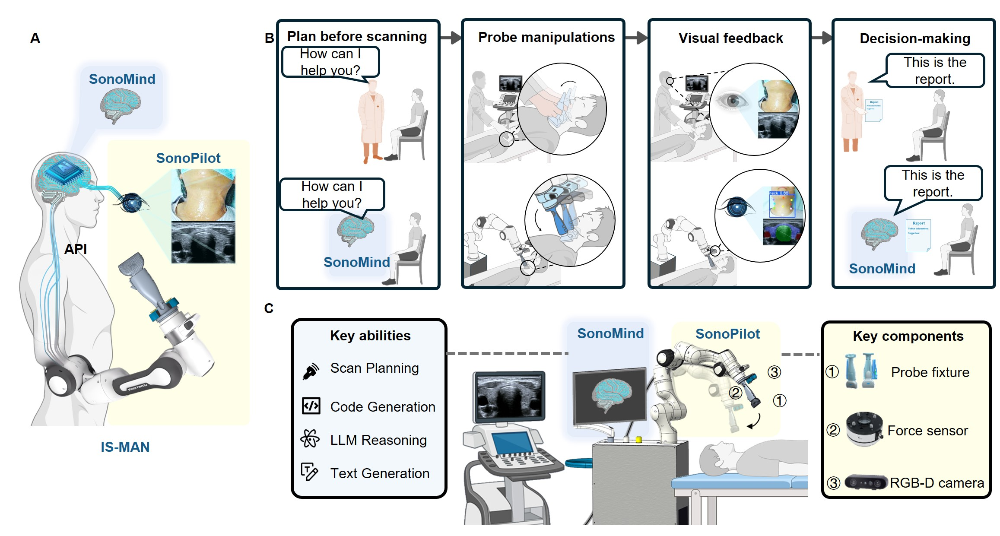
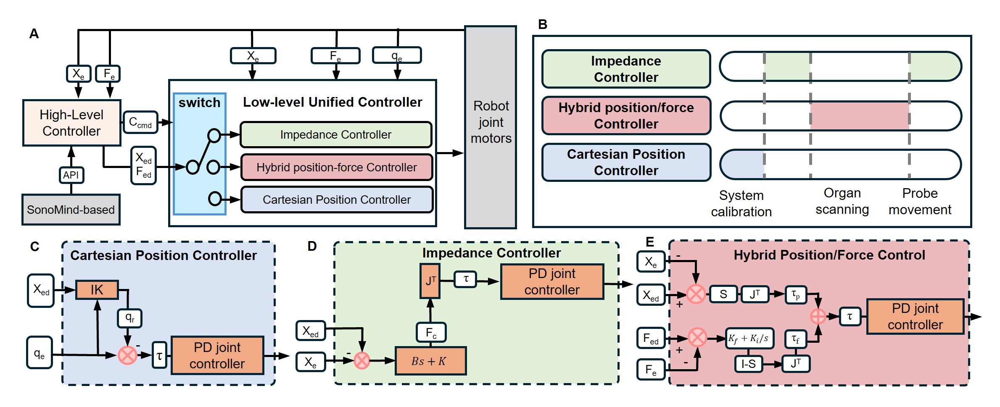
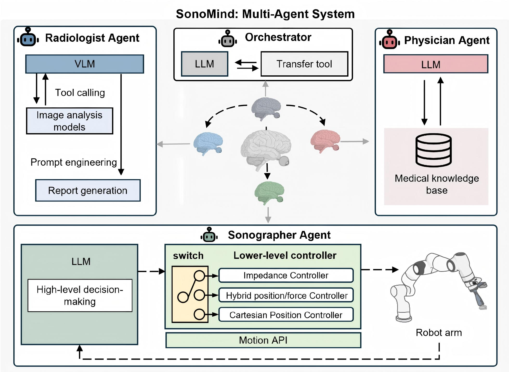

# IS-MAN: LLM-driven Embodied Intelligence System for Autonomous Ultrasound



> This repository contains the source code, and pretrained models for the IS-MAN system, a large-scale LLM-empowered embodied intelligence framework for fully autonomous ultrasound-based thyroid cancer screening in real-world clinical settings.

## Overview

**IS-MAN** (Intelligent Sono-Robotic Multi-Agent Nexus) is a clinically validated embodied AI system integrating robotic force control, dynamic visual servoing, and LLM-powered multi-agent decision-making for autonomous ultrasound-based thyroid screening. It comprises two synergistic modules:

- **SonoPilot**: A real-time adaptive control module responsible for safe, stable, and anatomically precise robotic scanning.
- **SonoMind**: A cognitive multi-agent system orchestrated by a large language model, enabling perception, decision-making, and clinical reasoning across four roles—triage, sonographer, radiologist, and physician.

IS-MAN was deployed and evaluated in a prospective human study with over 500 participants, achieving high scanning success rates, clinically equivalent image quality, and expert-level diagnosis accuracy, marking a significant advancement in autonomous medical robotics.

---

## Repository Structure

```
IS-MAN
├── Sonopilot
├── Sonomind
├── SegNet
├── LesionDetection
├── KeypointDetection
└── Franka_ws
```

- **SonoPilot**: Implementations of hybrid force–position control, impedance control, and Cartesian position control for the robotic manipulator.
- **SonoMind**: The multi-agent framework coordinating perception, control, and decision modules as used in the autonomous workflow.
- **SonoMind**: Real-time segmentation: a segmentation pipeline supporting multiple target anatomies (thyroid, carotid artery, liver) with inference scripts and model configurations for clinical deployment.
- **LesionDetection**: Thyroid-nodule detection module with inference scripts
- **KeypointDetection**: Keypoint Detection for Thyroid Localization
- **Franka_ws**: 

---

## Installation & Configuration

**Environment Setup**

```bash
conda create -n franka python=3.10
conda activate franka
pip install -r requirements.txt
```

## SonoPilot: Adaptive Force-Position Control Framework for Robotic Ultrasound Scanning



**SonoPilot** is a core module of the IS-MAN (Intelligent Sono-Robotic Multi-Agent Nexus) system. It is designed to autonomously control a robotic manipulator for conducting high-precision ultrasound scanning with compliant and adaptive interaction capabilities.

---

### 🔧 Overview of Capabilities

This system enables seamless switching between:

- Cartesian Position Control
- Impedance Control
- Hybrid Force-Position Control
- Dynamic Controller Switching

---

### 📂 Key File: `ForcePosition_calib.py`

Includes:

- Initialization of Franka Emika Panda robot interface
- Calibration of hybrid force-position control
- Real-time force feedback handling


---

### 📌 Dependencies
- Ubuntu 20.04
- ROS Noetic
- MoveIt
- Franka ROS Interface
- Python ≥3.7


---

### 🚀 Controller Usage Examples

#### Cartesian Position Controller

```python
franka = MoveItFranka()
franka.switch_controllers(
    [franka.hybrid_force_position_controller_name],
    [franka.cartesian_position_controller_name]
)
```

#### Impedance Controller

```python
franka = MoveItFranka()
franka.hybrid_2_impedance()
franka.update_param(is_scaning=False, translational_stiffness=300, rotational_stiffness=50)
```

#### Hybrid Force-Position Controller

```python
franka = MoveItFranka()
franka.impedance_2_hybrid()
franka.update_param(is_scaning=True, ext_force=2)
```

#### Dynamic Controller Switching

```python
franka.switch_controllers(
    start_controllers=['desired_controller'],
    stop_controllers=['current_controller'],
    strictness=2,
    start_asap=True,
    timeout=1
)
```


---

### 📖 Controller Parameters Explained

#### `update_param()` in Impedance or Hybrid Control

```python
franka.update_param(
    is_scaning=True,
    translational_stiffness=300,
    rotational_stiffness=50,
    ext_force=2
)
```

| Parameter | Type | Description |
|----------|------|-------------|
| `is_scaning` | `bool` | Whether the system is in scanning mode. This flag helps control behavior such as contact force regulation and trajectory constraints. |
| `translational_stiffness` | `float` | Linear (XYZ) stiffness of the impedance controller, in N/m. Larger values make the robot resist external displacement more strongly. |
| `rotational_stiffness` | `float` | Angular (roll-pitch-yaw) stiffness in Nm/rad. Higher value = less compliant to rotation. |
| `ext_force` | `float` | Target contact force (in Newtons) for hybrid force-position control. Typically set between 1–5 N for soft tissue scanning. |

> 💡 Only the parameters relevant to the current control mode will be used.

---

#### `switch_controllers()`

```python
franka.switch_controllers(
    start_controllers=['hybrid_controller'],
    stop_controllers=['impedance_controller'],
    strictness=2,
    start_asap=True,
    timeout=1
)
```

| Parameter | Type | Description |
|----------|------|-------------|
| `start_controllers` | `List[str]` | List of controller names to start. |
| `stop_controllers` | `List[str]` | List of controller names to stop. |
| `strictness` | `int` | Controller switch strictness. `0`: best-effort, `1`: medium strict, `2`: fully strict. |
| `start_asap` | `bool` | Whether to start the new controller as soon as possible. |
| `timeout` | `float` | Timeout (in seconds) to complete the switch. Raises error if timeout exceeded. |


---


## SonoMind — Multi-Agent Autonomous Ultrasound



- **SonoMind**: The multi-agent framework coordinating perception, control, and decision modules as used in the autonomous workflow.

### Repository structure

```
sonomind/
├── README.md                 # This file (overview + quickstart)
├── requirements.txt          # minimal Python deps
├── prompts/
│   ├── triage_prompt.py
│   ├── sonographer_prompt.py
│   ├── radiologist_prompt.py
│   └── physician_prompt.py
├── tools/                  
├── agents/
│   ├── triage_agent.py
│   ├── sonographer_agent.py
│   ├── radiologist_agent.py
│   └── physician_agent.py
├── models/
│   ├── prompts.py
│   └── inference.py          # model wrapper/adapter
├── fine_tune/
│   ├── lora_train.py
│   └── data/           
└── ...
```

---

### Quickstart (local simulation)

1. Clone the repo and create a virtual environment.

pip install -r requirements.txt


2. Start the tool API server

3. Start the agents

    python SonoMind/models/run_agents.py

4. Run a simple inference (example):

    python agents/triage_agent.py

---

### Model Foundation

Our system is built upon the **Qwen3 family of models**, including:

- **[Qwen3-8B](https://huggingface.co/Qwen/Qwen3-8B)**
- **[Qwen3-4B](https://huggingface.co/Qwen/Qwen3-4B-Instruct-2507)**
- **[Qwen3-8B-VL](https://huggingface.co/Qwen/Qwen3-VL-8B-Instruct)**

These models are trained and accessed using **LLaMAFactory**, following the official implementations and usage guidelines provided by the Qwen team. We sincerely appreciate their contributions to the open-source community.  

- **[LLaMAFactory Repository](https://github.com/hiyouga/LLaMA-Factory/tree/main)**

In building our system, we also leverage **[LangChain](https://github.com/langchain-ai/langchain)** for orchestrat


---


## License

All source code is made available under the **Apache-2.0 License**.

---

## 🔗 Dependencies and Acknowledgements

This project builds upon several open-source projects and pretrained models. We gratefully acknowledge the following repositories and frameworks:

- **libfranka** for low-level robotic control  
  https://github.com/frankaemika/libfranka

- **DFMS-Net** for benchmarking
https://github.com/LeapLabTHU/UltraBot

- **VariaNet** for benchmarking
  https://github.com/Ciel04sk/SCUT_Thyroid_DataSet

- **Qwen3 Models** for LLM-based agents in SonoMind  
  https://huggingface.co/Qwen

- **LLaMA 3.2 Models** (1B–11B-Vision-Instruct)  
  https://huggingface.co/meta-llama

- **Gemma & MedGemma Models**  
  https://huggingface.co/google

All code and models are used under their respective licenses. Please refer to their original repositories for license details.