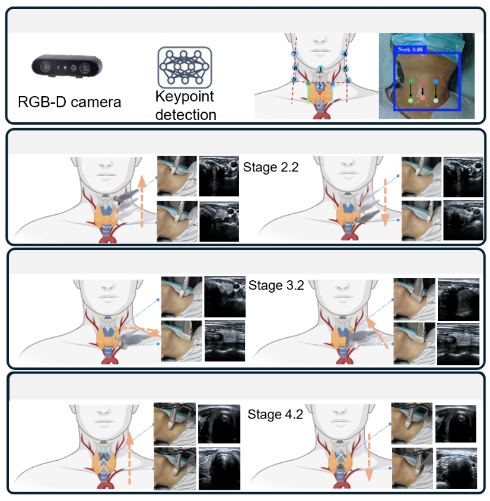
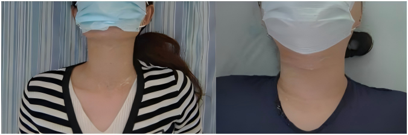
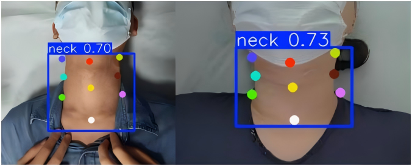

# IS-MAN: a First-in-Clinical Large-Scale Study of LLM-Driven Embodied Intelligence for Workflow-Level Autonomous Robotic Ultrasound


> This repository contains the source code, and pretrained models for the IS-MAN system, a large-scale LLM-empowered embodied intelligence framework for fully autonomous ultrasound-based thyroid cancer screening in real-world clinical settings.

## Overview

**IS-MAN** (Intelligent Sono-Robotic Multi-Agent Nexus) is a clinically validated embodied AI system integrating robotic force control, dynamic visual servoing, and LLM-powered multi-agent decision-making for autonomous ultrasound-based thyroid screening. It comprises two synergistic modules:

- **SonoPilot**: A real-time adaptive control module responsible for safe, stable, and anatomically precise robotic scanning.
- **SonoMind**: A cognitive multi-agent system orchestrated by a large language model, enabling perception, decision-making, and clinical reasoning across four roles—triage, sonographer, radiologist, and physician.

IS-MAN was deployed and evaluated in a prospective human study with over 500 participants, achieving high scanning success rates, clinically equivalent image quality, and expert-level diagnosis accuracy, marking a significant advancement in autonomous medical robotics.

---

## Repository Structure

```
IS-MAN/
├── SonoPilot                  # 🤖 Autonomous Scanning Control
├── SonoMind                   # 🧠 LLM-Powered Multi-Agent Cognition
├── Segmentation             # 🏥 Real-time Multi-Organ Segmentation
├── LesionDetection          # 🔍 Thyroid Nodule Detection
├── KeypointDetection        # 🎯 Anatomical Landmark Localization
├── Franka_ws                # 🛠️ ROS Development Workspace
├── demo                     # 🎥 System Demonstration Assets
├── LICENSE
└── README.md
```

- [**SonoPilot**](https://github.com/MedAI-UAIX/IS-MAN/tree/main/SonoPilot): Implementations of hybrid force–position control, impedance control, and Cartesian position control for the robotic manipulator.
- [**SonoMind**](https://github.com/MedAI-UAIX/IS-MAN/tree/main/SonoMind): The multi-agent framework coordinating perception, control, and decision modules as used in the autonomous workflow.
- [**Segmentation**](https://github.com/MedAI-UAIX/IS-MAN/tree/main/Segmentation): Real-time segmentation: a segmentation pipeline supporting multiple target anatomies (thyroid, carotid artery, liver, trachea) with inference scripts and model configurations for clinical deployment.
- [**LesionDetection**](https://github.com/MedAI-UAIX/IS-MAN/tree/main/LesionDetection): Thyroid-nodule detection module with inference scripts.
- [**KeypointDetection**](https://github.com/MedAI-UAIX/IS-MAN/tree/main/KeypointDetection): Keypoint Detection for Thyroid Localization.
- [**Franka_ws**](https://github.com/MedAI-UAIX/IS-MAN/tree/main/Franka_ws):   The ROS workspace designed for developing and running control applications for the [Franka Emika Panda](https://franka.de/) robot. It integrates the Franka ROS packages and provides a clean environment for real-time robot control, motion execution, and controller development.
- [**demo**](https://github.com/MedAI-UAIX/IS-MAN/tree/main/demo):   Contains sample images and visualizations demonstrating system capabilities across modules.


---
---


## SonoPilot: Adaptive Force-Position Control Framework for Robotic Ultrasound Scanning


**SonoPilot** is a core module of the IS-MAN (Intelligent Sono-Robotic Multi-Agent Nexus) system. It is designed to autonomously control a robotic manipulator for conducting high-precision ultrasound scanning with compliant and adaptive interaction capabilities.

---

### 🔧 Overview of Capabilities

This system enables seamless switching between:

- Dynamic Controller Switching
- Cartesian Position Control
- Impedance Control
- Hybrid Force-Position Control

---

### Repository Structure

```
SonoPilot
├── ForcePosition_calib.py
├── get_path_intP.py
├── README.md
└── requirements.txt
```

---

### 📌 Dependencies

The version requirements listed below are recommended configurations. Our code may be compatible with other mainstream versions of these dependencies, but full compatibility testing has not been completed.
- [Ubuntu 20.04](https://releases.ubuntu.com/20.04/)
- [ROS Noetic](https://wiki.ros.org/noetic)
- [MoveIt](https://moveit.ai/)
- [Franka ROS Interface](https://github.com/frankarobotics/franka_ros)
- Python ≥3.7
- [libfranka ≥0.13.0](https://github.com/frankarobotics/libfranka)

---

### Installation & Configuration

**Environment Setup**

```bash
conda create -n franka python=3.10
conda activate franka
pip install -r requirements.txt
```

---

### 📂 Key File: [`ForcePosition_calib.py`](https://github.com/MedAI-UAIX/IS-MAN/blob/main/SonoPilot/ForcePosition_calib.py)

Includes:

- Initialization of Franka Emika Panda robot interface
- Calibration of hybrid force-position control
- Real-time force feedback handling


---

### 🚀 Controller Usage Examples

#### Dynamic Controller Switching

Dynamic controller switching is the mechanism that allows SonoPilot to transition smoothly between different control strategies (e.g., from free-space movement to tissue contact). 

Fundamental Rules:
1.  **Check First**: Always query the system for the current status of all controllers.
2.  **Match States**:
    *   `start_controllers`: **Only accepts controllers currently in the `stopped` state.**
    *   `stop_controllers`: **Only accepts controllers currently in the `running` state.**

##### Step 1: Inspect Current States
Before issuing any switch command, use `list_controllers()` to print the status table.

```python
from ForcePosition_calib import MoveItFranka
franka = MoveItFranka()
franka.list_controllers()
```

Expected Terminal Output:

```python
Controller name: position_force_hybird_controller
Controller state: running
Controller name: franka_state_controller
Controller state: running
Controller name: cartesian_pose_ZJK_controller
Controller state: stopped
```

##### Step 2: Construct the Switch Command
Based on the output above, construct your `switch_controllers` call.

```python
franka.switch_controllers(
    start_controllers=['desired_controller'],
    stop_controllers=['current_controller'],
    strictness=2,
    start_asap=True,
    timeout=1
)
```

#### Cartesian Position Controller

```python
from ForcePosition_calib import MoveItFranka
franka = MoveItFranka()
franka.switch_controllers(
    [franka.hybrid_force_position_controller_name],
    [franka.cartesian_position_controller_name]
)
```

#### Impedance Controller

```python
from ForcePosition_calib import MoveItFranka
franka = MoveItFranka()
franka.hybrid_2_impedance()
franka.update_param(is_scaning=False, translational_stiffness=300, rotational_stiffness=50)
```

#### Hybrid Force-Position Controller

```python
from ForcePosition_calib import MoveItFranka
franka = MoveItFranka()
franka.impedance_2_hybrid()
franka.update_param(is_scaning=True, ext_force=2)
```


---

### 📖 Controller Parameters Explained

#### `update_param()` in Impedance or Hybrid Control

```python
franka.update_param(
    is_scaning=True,
    translational_stiffness=300,
    rotational_stiffness=50,
    ext_force=2
)
```

| Parameter | Type | Description |
|----------|------|-------------|
| `is_scaning` | `bool` | Whether the system is in scanning mode. This flag helps control behavior such as contact force regulation and trajectory constraints. |
| `translational_stiffness` | `float` | Linear (XYZ) stiffness of the impedance controller, in N/m. Larger values make the robot resist external displacement more strongly. |
| `rotational_stiffness` | `float` | Angular (roll-pitch-yaw) stiffness in Nm/rad. Higher value = less compliant to rotation. |
| `ext_force` | `float` | Target contact force (in Newtons) for hybrid force-position control. Typically set between 1–5 N for soft tissue scanning. |

> 💡 Only the parameters relevant to the current control mode will be used.

---

#### `switch_controllers()`

```python
franka.switch_controllers(
    start_controllers=['hybrid_controller'],
    stop_controllers=['impedance_controller'],
    strictness=2,
    start_asap=True,
    timeout=1
)
```

| Parameter | Type | Description |
|----------|------|-------------|
| `start_controllers` | `List[str]` | List of controller names to start. |
| `stop_controllers` | `List[str]` | List of controller names to stop. |
| `strictness` | `int` | Controller switch strictness. `0`: best-effort, `1`: medium strict, `2`: fully strict. |
| `start_asap` | `bool` | Whether to start the new controller as soon as possible. |
| `timeout` | `float` | Timeout (in seconds) to complete the switch. Raises error if timeout exceeded. |


---
---

## SonoMind — Multi-Agent Autonomous Ultrasound


### Repository structure

```
.
├── agents
│   ├── orchestrator.py
│   ├── physician.py
│   ├── radiologist.py
│   └── sonographer.py
├── main_UI.py
├── models
│   ├── orchestrator.yaml
│   ├── physician.yaml
│   ├── radiologist.yaml
│   ├── run_agents.py
│   └── sonographer.yaml
├── patient
│   └── 001
├── prompt
│   ├── orchestrator_prompt.py
│   ├── physician_prompt.py
│   ├── radiologist_prompt.py
│   └── sonographer_prompt.py
├── README.md
├── requirements.txt
├── tools
│   ├── build_vector_db.py
│   ├── FrankaRequest.py
│   ├── pubmedbert-base
│   ├── radiologist_tools.py
│   ├── RobotServer
│   ├── SonoPilot.py
│   ├── throid_TI-RADS
│   ├── thynet
│   ├── thynets
│   └── vector_db_docx_pubmedbert-base_structured
└── utils.py
```

---

### Model Configuration

SonoMind supports different large language models through API-based model services. Users may run the framework with commercial LLM/VLM providers, locally deployed open-source models, or the model weights used in this study, which are available upon reasonable request.

#### 1. Using Commercial API Providers

To use commercial API providers, obtain an API key and base URL from at least one supported provider, such as:

- [OpenAI](https://platform.openai.com/)
- [Anthropic Claude](https://console.anthropic.com/)
- [Google Gemini](https://ai.google.dev/)
- [DeepSeek](https://platform.deepseek.com/)

Then specify the key and endpoint URLs in `main_UI.py`:

```python
API_KEY = "your_api_key"

orchestrator_base_url = "your_orchestrator_base_url"
sonographer_base_url = "your_sonographer_base_url"
radiologist_base_url = "your_radiologist_base_url"
physician_base_url = "your_physician_base_url"
```

Each agent can be configured with a different model service. 

---

#### 2. Using Local Models

In this study, local large language models were deployed as API services using [LLaMA-Factory](https://github.com/hiyouga/LLaMA-Factory/tree/main).

##### Step 1. Install LLaMA-Factory

```bash
git clone --depth 1 https://github.com/hiyouga/LlamaFactory.git
cd LlamaFactory

conda create -n llamafactory python=3.10
conda activate llamafactory

pip install -e .
pip install -r requirements/metrics.txt
```

##### Step 2. Download Model Weights

Download the required model weights and place them under:

```bash
SonoMind/models/
```

The models used in this study include:

- **[Qwen3-8B](https://huggingface.co/Qwen/Qwen3-8B)**
- **[Qwen3-4B](https://huggingface.co/Qwen/Qwen3-4B-Instruct-2507)**
- **[Qwen3-8B-VL](https://huggingface.co/Qwen/Qwen3-VL-8B-Instruct)**

Model backbones can be downloaded from the corresponding model repositories. Fine-tuned adapters used in this study can be configured through `adapter_name_or_path` in the corresponding YAML files and may be made available for academic use upon reasonable request by contacting the corresponding author.

##### Step 3. Configure Model YAML Files

Configure the model YAML files in:

```bash
SonoMind/models/
```

> **Note:** For functional testing or custom deployment without fine-tuned adapters, `adapter_name_or_path` can be commented out.

Each YAML file should specify the base model path, optional adapter path, prompt template, and inference backend.

##### Step 4. Start Local Model API Services

Run:

```bash
python SonoMind/models/run_agents.py
```

This script launches the configured local models as API services.

##### Step 5. Update API URLs

Copy the generated API URLs into `main_UI.py`:

```python
API_KEY = "0"  # default value for local model services

orchestrator_base_url = "your_orchestrator_base_url"
sonographer_base_url = "your_sonographer_base_url"
radiologist_base_url = "your_radiologist_base_url"
physician_base_url = "your_physician_base_url"
```

---

### Tools Configuration

SonoMind uses external tools for robotic scanning, image interpretation, and clinical decision support. Please configure the required tools before running the full system.

#### 1. Sonographer Agent Tools

The sonographer agent interacts with the robotic arm control API. Start the robotic arm control service using the environment configured in the SonoPilot module:

```bash
conda activate franka
python SonoPilot.py
```

**If no robotic arm is available, you can still verify the code by following the [Quickstart](#Quickstart) guide. In the user interface, locate the "Robot Execution" status panel and click the "Simulate" button as shown in the image below.**


---

#### 2. Radiologist Agent Tools

The radiologist agent uses additional tools for thyroid ultrasound image analysis and follow-up recommendation generation.

##### Follow-up Tool

The follow-up LLM tool was developed based on [Gemini 2.5 Flash](https://ai.google.dev/gemini-api/docs/models#gemini-2.5-flash). To use this tool, obtain an API key and endpoint URL from Google AI Studio, and specify them in the `FollowUpTool` configuration in `tools/radiologist_tools.py`.

##### Diagnostic Models

The default weights are used when running the code directly. The weights used for thyroid nodule benign–malignant diagnosis, including **ThyNet** and **ThyNet-S**, as well as the model used for **TI-RADS classification**, may be made available for academic use upon reasonable request.

---

#### 3. Physician Agent Tools

The physician agent uses PubMedBERT-indexed guideline knowledge to support evidence-informed clinical recommendations.

##### Model Preparation
Before running the physician agent, **please manually download the pre-trained PubMedBERT model** from [Hugging Face](https://huggingface.co/NeuML/pubmedbert-base-embeddings/tree/main) and place it into the [`SonoMind/tools/`](https://github.com/MedAI-UAIX/IS-MAN/tree/main/SonoMind/tools) folder.

---

### Quickstart
We provide a demo to test the feasibility of the SonoMind workflow.

#### 1. Clone the Repository and Create a Virtual Environment

```bash
cd SonoMind

conda create -n sonomind python=3.10
conda activate sonomind
```

#### 2. Install Dependencies

```bash
pip install -r requirements.txt
```

#### 3. Download Models and Start the Tool API Servers

Download the required model weights and configure the model files as described in [Model Configuration](#model-configuration).

If you use the robotic arm, also start the sonographer tool API as described in [Tools Configuration](#tools-configuration).

#### 4. Start the Agent Services

```bash
python SonoMind/models/run_agents.py
```

> **Note:** If your local machine has limited computational resources, you can deploy the agents on a remote server. However, to minimize latency and ensure the safety of the robotic arm, it is strongly recommended to deploy the sonographer agent on the same machine that directly controls the robotic arm.

#### 5. Specify the Patient ID

Specify the patient ID in main_UI.py. The default patient ID is 001.

#### 5. Run a Simple Inference Demo

```bash
python main_UI.py
```

---

### Demo Video

A demonstration video of the SonoMind workflow is available. You can refer to this video for a quick overview of the system's capabilities and usage.


https://github.com/user-attachments/assets/fbd91e40-43a9-4551-913f-6670c958560f


---

### Model Foundation

Our system is built upon the **Qwen3 family of models**, including:

- **[Qwen3-8B](https://huggingface.co/Qwen/Qwen3-8B)**
- **[Qwen3-4B](https://huggingface.co/Qwen/Qwen3-4B-Instruct-2507)**
- **[Qwen3-8B-VL](https://huggingface.co/Qwen/Qwen3-VL-8B-Instruct)**

These models are trained and accessed using **LLaMAFactory**, following the official implementations and usage guidelines provided by the Qwen team. We sincerely appreciate their contributions to the open-source community.  

- **[LLaMAFactory Repository](https://github.com/hiyouga/LLaMA-Factory/tree/main)**

In building our system, we also leverage **[LangChain](https://github.com/langchain-ai/langchain)** for orchestration.

---

### Notes

This repository provides the SonoMind framework code and configuration templates. The following items are not included in this repository and must be prepared by the user:
- Pretrained or fine‑tuned model weights (e.g., ThyNet, ThyNet‑S, TI‑RADS classification model).
- Third‑party models (e.g., PubMedBERT) and any tool‑specific dependencies or environments (e.g., the franka conda environment for the robotic arm).
- Tool data or indexes (e.g., vector databases) that are used by the tools under tools/.

Please refer to the instructions in Tools Configuration for detailed setup steps.
**The code in tools/RobotServer may contain paths or configurations that depend on local environments (e.g., data directories, conda environments, or device IPs).
Please adjust these paths according to your setup before running the services.**


---
---


## Keypoint Detection for Thyroid Localization



### 🩺 Model Description

This module is designed to perform keypoint detection tasks. It takes the original image as input and outputs the coordinates and confidence scores of the detected keypoints.

#### **Key Features**
- **Thyroid Localization via Keypoints**  
  Predicts sparse anatomical keypoints that characterize thyroid pose and morphology, enabling stable robotic alignment.

- **High Inference Efficiency**  
  Powered by [YOLO-Pose](https://github.com/ultralytics/ultralytics) for fast inference suitable for real‑time or near‑real‑time clinical use.

---

### Repository Structure

```
KeypointDetection/
├── README.md
├── inference.py
├── input/
└── output/
```

---

### 📌 Pretrained Weights

Ours YOLO weights can be downloaded from:

👉 **HuggingFace Model Hub**  
https://huggingface.co/CJH104/KeypointDetection/tree/main

Download:

```
yolo11m_pose_best_thy_ketpoint.pt
```

Place the weights here:

```
KeypointDetection/checkpoint/yolo11m_pose_best_thy_ketpoint.pt
```

---

#### 🚀 Inference Usage

The inference script:

```
KeypointDetection/inference.py
```

---

##### ⚡ CUDA Inference

```bash
python KeypointDetection/inference.py   --weights KeypointDetection/checkpoint/yolo11m_pose_best_thy_keypoint.pt   --img_path KeypointDetection/input/test1.jpg   --save_path KeypointDetection/output/thyroid_keypoint_result1.jpg   --device cuda
```

---

##### 🖥️ CPU Inference

```bash
python KeypointDetection/inference.py   --weights KeypointDetection/checkpoint/yolo11m_pose_best_thy_keypoint.pt   --img_path KeypointDetection/input/test1.jpg   --save_path KeypointDetection/output/thyroid_keypoint_result1.jpg   --device cpu
```

---

##### ⚙️ Parameters

| Argument       | Type   | Default                                     | Description |
|----------------|--------|---------------------------------------------|-------------|
| `--weights`    | str    | `checkpoint/yolo11m_pose_best_thy_keypoint.pt`    | Path to pretrained YOLO-Pose weights |
| `--img_path`   | str    | `input/test1.jpg`           | Input image |
| `--save_path`  | str    | `output/thyroid_keypoint_result1.jpg`   | Output detection result |
| `--device`     | str    | `cuda`                                      | cuda or cpu |
| `--conf`       | float  | `0.3`                                      | Confidence threshold |

---

##### 🖼️ Visualization

###### **Input Image**



###### **Output Image**




---
---


## Real-time segmentation of the multi-Organ


> Architecture of the U-Net model for real-time segmentation of the thyroid, trachea, carotid artery and liver.

### UNet with Reparameterizable Convolution for Multi-Organ Segmentation

This repository provides an inference implementation of a **UNet model with Reparameterizable Convolution blocks**, designed for multi-organ segmentation in ultrasound images (thyroid, carotid artery, trachea, liver).

The model supports both **CUDA (GPU)** and **CPU** inference.

------------------------------------------------------------------------

### Repository Structure

```
Segmentation/
├── README.md
├── inference.py
├── model/
├── input/
└── output/
```

------------------------------------------------------------------------

### 📌 Pretrained Weights
**Ours pretrained weights are provided on HuggingFace.**

👉 **HuggingFace Model Hub**\
https://huggingface.co/medaiming/UnetReparamConv

Download `best.pth` and place it into:

    Segmentation/checkpoint/

------------------------------------------------------------------------


#### 🚀 Inference Usage

The inference script is located at:

    Segmentation/inference.py

#### **Basic Command**

``` bash
python Segmentation/inference.py     --img_path Segmentation/input/thyroid.png     --checkpoint Segmentation/checkpoint/best.pth     --save_path Segmentation/output/thyroid.png     --device cuda
```

------------------------------------------------------------------------

##### ⚡ CUDA Inference

``` bash
python Segmentation/inference.py     --img_path Segmentation/input/thyroid.png     --checkpoint Segmentation/checkpoint/best.pth     --save_path Segmentation/output/thyroid.png     --device cuda
```

------------------------------------------------------------------------

##### 🖥️ CPU Inference

``` bash
python Segmentation/inference.py     --img_path Segmentation/input/thyroid.png     --checkpoint Segmentation/checkpoint/best.pth     --save_path Segmentation/output/thyroid.png     --device cpu
```

------------------------------------------------------------------------

##### ⚙️ Parameters

| Argument       | Type   | Default                                     | Description |
|----------------|--------|---------------------------------------------|-------------|
| `--weights`   | str    | `checkpoint/best.pth`           | Model weights |
| `--img_path`    | str    | `input/thyroid.png`    | Input ultrasound image |
| `--save_path`  | str    | `output/thyroid.png`   | Output overlay path |
| `--device`     | str    | `cuda`                                      | cuda or cpu |

------------------------------------------------------------------------

##### 🖼️ Visualization

###### **Input Image**


##### **Output Image**


------------------------------------------------------------------------

### 🏥 Multi-Class Colors

| Label | Organ          | Color (B,G,R)  |
|-------|----------------|----------------|
| 0     | Background     | Transparent    |
| 1     | Thyroid        | (255, 0, 0)    |
| 2     | Carotid artery | (0, 0, 255)    |
| 3     | Trachea        | (0, 255, 255)  |
| 4     | Liver          | (0, 255, 0)    |


---
---

## Thyroid-nodule detection


### 🩺 YOLO-Based Thyroid Lesion Detection

#### 🩺 Model Description

This detection model is specifically designed for **thyroid nodule detection** in ultrasound images.  
Thyroid nodules (lesions) are common findings in clinical ultrasound examination, and accurate detection is essential for early diagnosis and risk stratification.

The model was trained on real-world thyroid ultrasound images with expert-annotated nodule bounding boxes.  
It is optimized for the characteristics of **B-mode ultrasound**, including noise patterns, low contrast, and variable imaging quality.

##### **Key Features**
- **Thyroid Nodule Detection**  
  Accurately locates potential thyroid lesions using bounding boxes.

- **High Inference Efficiency**  
  Built on the Ultralytics YOLO framework, supporting real-time or near real-time inference on both GPU (CUDA) and CPU.

-  **Designed for Medical Ultrasound**  
  Tailored for grayscale thyroid ultrasound imaging scenarios.

---

### Repository Structure

```
LesionDetection/
├── README.md
├── inference.py
├── input/
└── output/
```

---

### 📌 Pretrained Weights

Ours YOLO weights can be downloaded from:

👉 **HuggingFace Model Hub**  
https://huggingface.co/CJH104/ThyroidLesionDetection/tree/main

Download:

```
TNS_best.pt
```

Place the weights here:

```
LesionDetection/checkpoint/TNS_best.pt
```

---

#### 🚀 Inference Usage

The inference script:

```
LesionDetection/inference.py
```

---

##### ⚡ CUDA Inference

```bash
python LesionDetection/inference.py   --weights LesionDetection/checkpoint/TNS_best.pt   --img_path LesionDetection/input/test1.jpg   --save_path LesionDetection/output/test1.jpg   --device cuda   --conf 0.25
```

---

##### 🖥️ CPU Inference

```bash
python LesionDetection/inference.py   --weights LesionDetection/checkpoint/TNS_best.pt   --img_path LesionDetection/input/test2.jpg   --save_path LesionDetection/output/test2.jpg   --device cpu   --conf 0.25
```

---

##### ⚙️ Parameters

| Argument       | Type   | Default                                     | Description |
|----------------|--------|---------------------------------------------|-------------|
| `--weights`    | str    | `checkpoint/TNS_best.pt`    | Path to YOLO weights |
| `--img_path`   | str    | `input/test1.jpg`           | Input ultrasound image |
| `--save_path`  | str    | `output/test1.jpg`   | Output detection result |
| `--device`     | str    | `cuda`                                      | cuda or cpu |
| `--conf`       | float  | `0.25`                                      | Confidence threshold |

---

##### 🖼️ Visualization

###### **Input Image**


###### **Output Image**


---
---


## License

All source code is made available under the **Apache-2.0 License**.

---

## 🔗 Dependencies and Acknowledgements

This project builds upon several open-source projects and pretrained models. We gratefully acknowledge the following repositories and frameworks:

- **libfranka** for low-level robotic control  
  https://github.com/frankaemika/libfranka

- **DFMS-Net** for benchmarking
  https://github.com/LeapLabTHU/UltraBot

- **VariaNet** for benchmarking
  https://github.com/Ciel04sk/SCUT_Thyroid_DataSet

- **Qwen3 Models** for LLM-based agents in SonoMind  
  https://huggingface.co/Qwen

- **LLaMA 3.2 Models** (1B–11B-Vision-Instruct)  
  https://huggingface.co/meta-llama

- **Gemma & MedGemma Models**  
  https://huggingface.co/google

- **Ultralytics YOLO**  
  https://github.com/ultralytics/ultralytics

- **FishBot ROS Installation Tool**  
  https://github.com/fishros/install

All code and models are used under their respective licenses. Please refer to their original repositories for license details.
