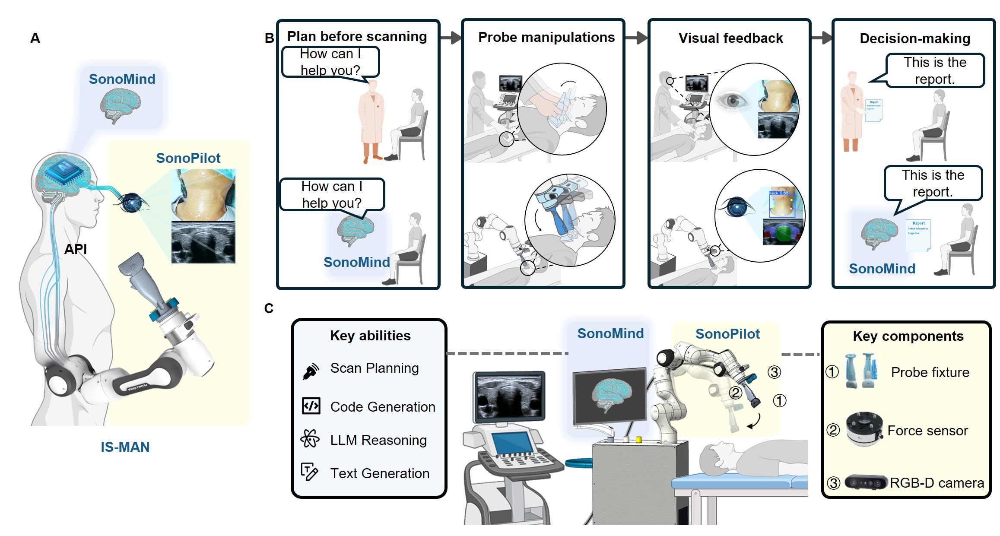
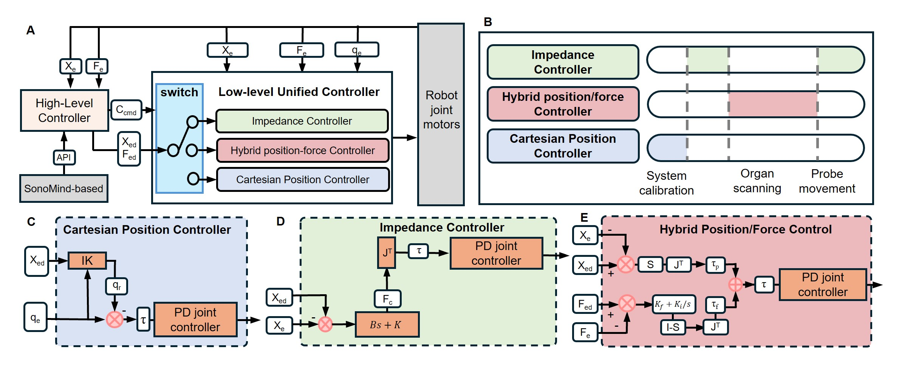
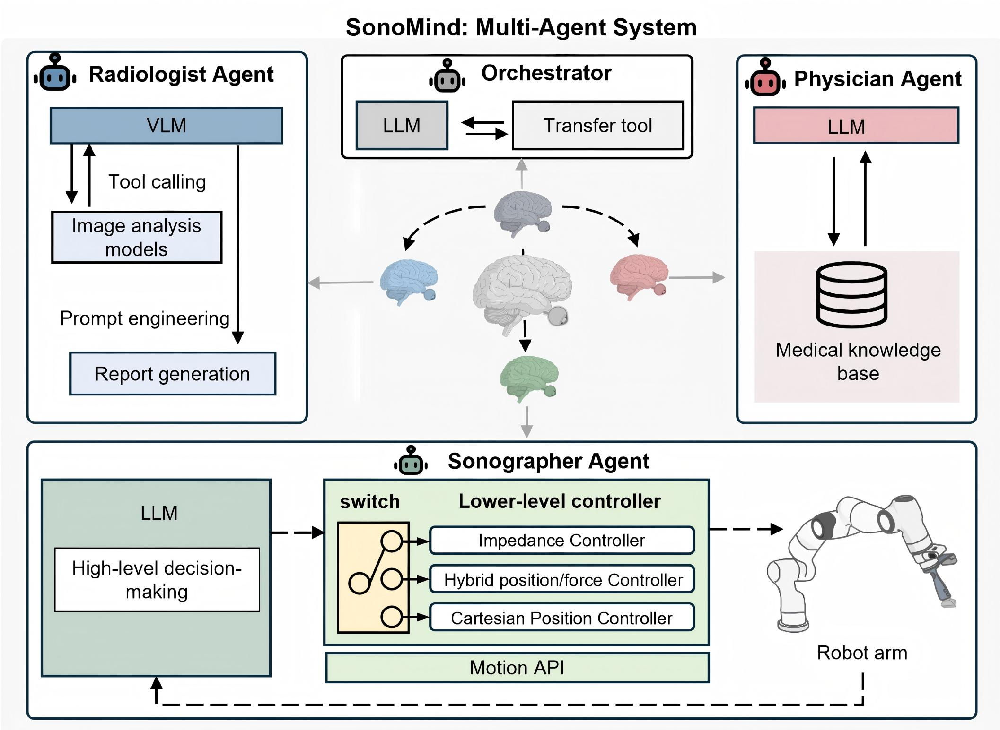
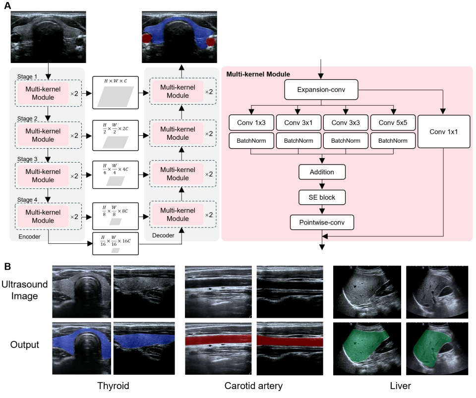
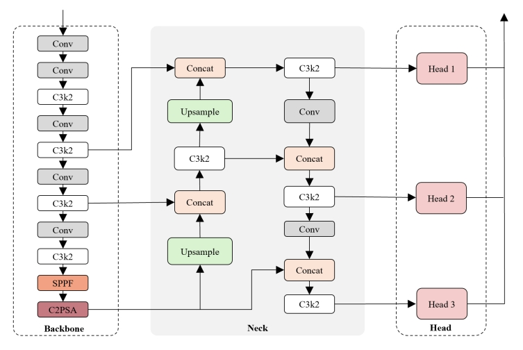
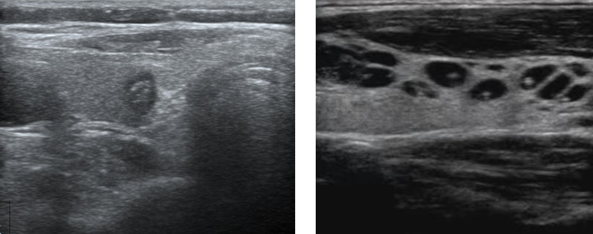
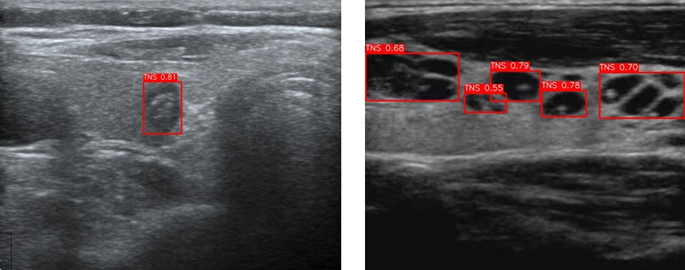

# IS-MAN: LLM-driven Embodied Intelligence System for Autonomous Ultrasound



> This repository contains the source code, and pretrained models for the IS-MAN system, a large-scale LLM-empowered embodied intelligence framework for fully autonomous ultrasound-based thyroid cancer screening in real-world clinical settings.

## Overview

**IS-MAN** (Intelligent Sono-Robotic Multi-Agent Nexus) is a clinically validated embodied AI system integrating robotic force control, dynamic visual servoing, and LLM-powered multi-agent decision-making for autonomous ultrasound-based thyroid screening. It comprises two synergistic modules:

- **SonoPilot**: A real-time adaptive control module responsible for safe, stable, and anatomically precise robotic scanning.
- **SonoMind**: A cognitive multi-agent system orchestrated by a large language model, enabling perception, decision-making, and clinical reasoning across four roles—triage, sonographer, radiologist, and physician.

IS-MAN was deployed and evaluated in a prospective human study with over 500 participants, achieving high scanning success rates, clinically equivalent image quality, and expert-level diagnosis accuracy, marking a significant advancement in autonomous medical robotics.

---

## Repository Structure

```
IS-MAN
├── SonoPilot
├── SonoMind
├── Segmentation
├── LesionDetection
├── KeypointDetection
└── Franka_ws
```

- **SonoPilot**: Implementations of hybrid force–position control, impedance control, and Cartesian position control for the robotic manipulator.
- **SonoMind**: The multi-agent framework coordinating perception, control, and decision modules as used in the autonomous workflow.
- **Segmentation**: Real-time segmentation: a segmentation pipeline supporting multiple target anatomies (thyroid, carotid artery, liver, trachea) with inference scripts and model configurations for clinical deployment.
- **LesionDetection**: Thyroid-nodule detection module with inference scripts.
- **KeypointDetection**: Keypoint Detection for Thyroid Localization.
- **Franka_ws**:   The ROS workspace designed for developing and running control applications for the Franka Emika Panda robot. It integrates the Franka ROS packages and provides a clean environment for real-time robot control, motion execution, and controller development.


---
---


## SonoPilot: Adaptive Force-Position Control Framework for Robotic Ultrasound Scanning




**SonoPilot** is a core module of the IS-MAN (Intelligent Sono-Robotic Multi-Agent Nexus) system. It is designed to autonomously control a robotic manipulator for conducting high-precision ultrasound scanning with compliant and adaptive interaction capabilities.

---

### 🔧 Overview of Capabilities

This system enables seamless switching between:

- Cartesian Position Control
- Impedance Control
- Hybrid Force-Position Control
- Dynamic Controller Switching

---

## Installation & Configuration

**Environment Setup**

```bash
conda create -n franka python=3.10
conda activate franka
pip install -r requirements.txt
```

---

### 📂 Key File: `ForcePosition_calib.py`

Includes:

- Initialization of Franka Emika Panda robot interface
- Calibration of hybrid force-position control
- Real-time force feedback handling


---

### 📌 Dependencies
- Ubuntu 20.04
- ROS Noetic
- MoveIt
- Franka ROS Interface
- Python ≥3.7
- libfranka ≥0.13.0


---

### 🚀 Controller Usage Examples

#### Cartesian Position Controller

```python
franka = MoveItFranka()
franka.switch_controllers(
    [franka.hybrid_force_position_controller_name],
    [franka.cartesian_position_controller_name]
)
```

#### Impedance Controller

```python
franka = MoveItFranka()
franka.hybrid_2_impedance()
franka.update_param(is_scaning=False, translational_stiffness=300, rotational_stiffness=50)
```

#### Hybrid Force-Position Controller

```python
franka = MoveItFranka()
franka.impedance_2_hybrid()
franka.update_param(is_scaning=True, ext_force=2)
```

#### Dynamic Controller Switching

```python
franka.switch_controllers(
    start_controllers=['desired_controller'],
    stop_controllers=['current_controller'],
    strictness=2,
    start_asap=True,
    timeout=1
)
```


---

### 📖 Controller Parameters Explained

#### `update_param()` in Impedance or Hybrid Control

```python
franka.update_param(
    is_scaning=True,
    translational_stiffness=300,
    rotational_stiffness=50,
    ext_force=2
)
```

| Parameter | Type | Description |
|----------|------|-------------|
| `is_scaning` | `bool` | Whether the system is in scanning mode. This flag helps control behavior such as contact force regulation and trajectory constraints. |
| `translational_stiffness` | `float` | Linear (XYZ) stiffness of the impedance controller, in N/m. Larger values make the robot resist external displacement more strongly. |
| `rotational_stiffness` | `float` | Angular (roll-pitch-yaw) stiffness in Nm/rad. Higher value = less compliant to rotation. |
| `ext_force` | `float` | Target contact force (in Newtons) for hybrid force-position control. Typically set between 1–5 N for soft tissue scanning. |

> 💡 Only the parameters relevant to the current control mode will be used.

---

#### `switch_controllers()`

```python
franka.switch_controllers(
    start_controllers=['hybrid_controller'],
    stop_controllers=['impedance_controller'],
    strictness=2,
    start_asap=True,
    timeout=1
)
```

| Parameter | Type | Description |
|----------|------|-------------|
| `start_controllers` | `List[str]` | List of controller names to start. |
| `stop_controllers` | `List[str]` | List of controller names to stop. |
| `strictness` | `int` | Controller switch strictness. `0`: best-effort, `1`: medium strict, `2`: fully strict. |
| `start_asap` | `bool` | Whether to start the new controller as soon as possible. |
| `timeout` | `float` | Timeout (in seconds) to complete the switch. Raises error if timeout exceeded. |


---
---

## SonoMind — Multi-Agent Autonomous Ultrasound



- **SonoMind**: The multi-agent framework coordinating perception, control, and decision modules as used in the autonomous workflow.

### Repository structure

```
sonomind/
├── README.md                 # This file (overview + quickstart)
├── requirements.txt          # minimal Python deps
├── prompts/
│   ├── triage_prompt.py
│   ├── sonographer_prompt.py
│   ├── radiologist_prompt.py
│   └── physician_prompt.py
├── tools/                  
├── agents/
│   ├── triage_agent.py
│   ├── sonographer_agent.py
│   ├── radiologist_agent.py
│   └── physician_agent.py
├── models/
│   ├── prompts.py
│   └── inference.py          # model wrapper/adapter
├── fine_tune/
│   ├── lora_train.py
│   └── data/           
└── ...
```

---

### Quickstart (local simulation)

1. Clone the repo and create a virtual environment.
``` bash
pip install -r requirements.txt
```

2. Start the tool API server

3. Start the agents
``` bash
python SonoMind/models/run_agents.py
```
4. Run a simple inference (example):
``` bash
python agents/triage_agent.py
```
---

### Model Foundation

Our system is built upon the **Qwen3 family of models**, including:

- **[Qwen3-8B](https://huggingface.co/Qwen/Qwen3-8B)**
- **[Qwen3-4B](https://huggingface.co/Qwen/Qwen3-4B-Instruct-2507)**
- **[Qwen3-8B-VL](https://huggingface.co/Qwen/Qwen3-VL-8B-Instruct)**

These models are trained and accessed using **LLaMAFactory**, following the official implementations and usage guidelines provided by the Qwen team. We sincerely appreciate their contributions to the open-source community.  

- **[LLaMAFactory Repository](https://github.com/hiyouga/LLaMA-Factory/tree/main)**

In building our system, we also leverage **[LangChain](https://github.com/langchain-ai/langchain)** for orchestrat


---

---


## Real-time segmentation of the multi-Organ



> Architecture of the U-Net model for real-time segmentation of the thyroid, trachea, carotid artery and liver.

### UNet with Reparameterizable Convolution for Multi-Organ Segmentation

This repository provides an inference implementation of a **UNet model with Reparameterizable Convolution blocks**, designed for multi-organ segmentation in ultrasound images (thyroid, carotid artery, trachea, liver).

The model supports both **CUDA (GPU)** and **CPU** inference.

------------------------------------------------------------------------

### 📌 Pretrained Weights
**Ours pretrained weights are provided on HuggingFace.**

👉 **HuggingFace Model Hub**\
https://huggingface.co/medaiming/UnetReparamConv

Download `best.pth` and place it into:

    Segmentation/checkpoint/

------------------------------------------------------------------------


#### 🚀 Inference Usage

The inference script is located at:

    Segmentation/inference.py

#### **Basic Command**

``` bash
python Segmentation/inference.py     --img_path Segmentation/demo/image/thyroid.png     --checkpoint Segmentation/checkpoint/best.pth     --save_path Segmentation/output/thyroid.png     --device cuda
```

------------------------------------------------------------------------

##### ⚡ CUDA Inference

``` bash
python Segmentation/inference.py     --img_path Segmentation/demo/image/thyroid.png     --checkpoint Segmentation/checkpoint/best.pth     --save_path Segmentation/output/thyroid.png     --device cuda
```

------------------------------------------------------------------------

##### 🖥️ CPU Inference

``` bash
python Segmentation/inference.py     --img_path Segmentation/demo/image/thyroid.png     --checkpoint Segmentation/checkpoint/best.pth     --save_path Segmentation/output/thyroid.png     --device cpu
```

------------------------------------------------------------------------

##### ⚙️ Parameters

  -----------------------------------------------------------------------------
  Argument         Type   Default                                 Description
  ---------------- ------ --------------------------------------- -------------
  `--img_path`     str    `demo/image/thyroid.png`                Input
                                                                  ultrasound
                                                                  image

  `--checkpoint`   str    `checkpoint/best.pth`                   Model weights

  `--save_path`    str    `output/thyroid.png`                    Output
                                                                  overlay path

  `--device`       str    `cuda`                                  `cuda` or
                                                                  `cpu`
  -----------------------------------------------------------------------------

------------------------------------------------------------------------

##### 🖼️ Visualization

###### **Input Image**


##### **Output Image**


------------------------------------------------------------------------

### 🏥 Multi-Class Colors

| Label | Organ          | Color (B,G,R)  |
|-------|----------------|----------------|
| 0     | Background     | Transparent    |
| 1     | Thyroid        | (255, 0, 0)    |
| 2     | Carotid artery | (0, 0, 255)    |
| 3     | Trachea        | (0, 255, 255)  |
| 4     | Liver          | (0, 255, 0)    |


---
---

## Thyroid-nodule detection



### 🩺 YOLO-Based Thyroid Lesion Detection

#### 🩺 Model Description

This detection model is specifically designed for **thyroid nodule detection** in ultrasound images.  
Thyroid nodules (lesions) are common findings in clinical ultrasound examination, and accurate detection is essential for early diagnosis and risk stratification.

The model was trained on real-world thyroid ultrasound images with expert-annotated nodule bounding boxes.  
It is optimized for the characteristics of **B-mode ultrasound**, including noise patterns, low contrast, and variable imaging quality.

##### **Key Features**
- **Thyroid Nodule Detection**  
  Accurately locates potential thyroid lesions using bounding boxes.

- **High Inference Efficiency**  
  Built on the Ultralytics YOLO framework, supporting real-time or near real-time inference on both GPU (CUDA) and CPU.

-  **Designed for Medical Ultrasound**  
  Tailored for grayscale thyroid ultrasound imaging scenarios.


---

### 📦 Pretrained Weights

Ours YOLO weights can be downloaded from:

👉 **HuggingFace Model Hub**  
https://huggingface.co/CJH104/ThyroidLesionDetection/tree/main

Download:

```
TNS_best.pt
```

Place the weights here:

```
LesionDetection/checkpoint/TNS_best.pt
```

---

### 🚀 Inference Usage

The inference script:

```
LesionDetection/inference.py
```

---

#### ⚡ Inference on GPU (CUDA)

```bash
python LesionDetection/inference.py   --weights LesionDetection/checkpoint/TNS_best.pt   --img_path LesionDetection/input/test1.jpg   --save_path LesionDetection/output/test1.jpg   --device cuda   --conf 0.25
```

---

#### 🖥️ Inference on CPU

```bash
python LesionDetection/inference.py   --weights LesionDetection/checkpoint/TNS_best.pt   --img_path LesionDetection/input/test2.jpg   --save_path LesionDetection/output/test2.jpg   --device cpu   --conf 0.25
```

---

### 🔧 Command Line Arguments

| Argument       | Type   | Default                                     | Description |
|----------------|--------|---------------------------------------------|-------------|
| `--weights`    | str    | `LesionDetection/checkpoint/TNS_best.pt`    | Path to YOLO weights |
| `--img_path`   | str    | `LesionDetection/input/test1.jpg`           | Input ultrasound image |
| `--save_path`  | str    | `LesionDetection/output/test1_result.jpg`   | Output detection result |
| `--device`     | str    | `cuda`                                      | cuda or cpu |
| `--conf`       | float  | `0.25`                                      | Confidence threshold |

---

### 🖼️ Example Results

#### Input Image


#### Output Image


---
---


## License

All source code is made available under the **Apache-2.0 License**.

---

## 🔗 Dependencies and Acknowledgements

This project builds upon several open-source projects and pretrained models. We gratefully acknowledge the following repositories and frameworks:

- **libfranka** for low-level robotic control  
  https://github.com/frankaemika/libfranka

- **DFMS-Net** for benchmarking
https://github.com/LeapLabTHU/UltraBot

- **VariaNet** for benchmarking
  https://github.com/Ciel04sk/SCUT_Thyroid_DataSet

- **Qwen3 Models** for LLM-based agents in SonoMind  
  https://huggingface.co/Qwen

- **LLaMA 3.2 Models** (1B–11B-Vision-Instruct)  
  https://huggingface.co/meta-llama

- **Gemma & MedGemma Models**  
  https://huggingface.co/google

All code and models are used under their respective licenses. Please refer to their original repositories for license details.
