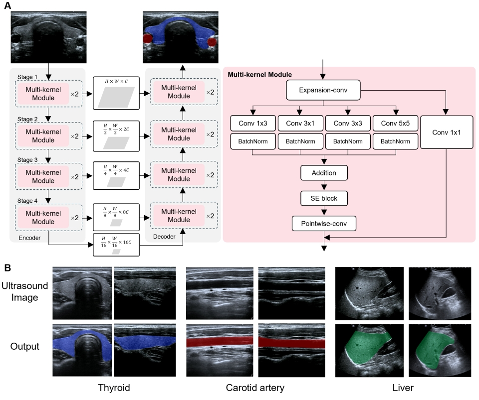

# Real-time segmentation of the multi-Organ



> Architecture of the U-Net model for real-time segmentation of the thyroid, trachea, carotid artery and liver.

# UNet with Reparameterizable Convolution for Multi-Organ Segmentation

This repository provides an inference implementation of a **UNet model
with Reparameterizable Convolution blocks**, designed for multi-organ
segmentation in ultrasound images (thyroid, carotid artery, trachea,
liver).

The model supports both **CUDA (GPU)** and **CPU** inference.\
Official pretrained weights are provided on HuggingFace.

------------------------------------------------------------------------

## 📌 Pretrained Weights

👉 **HuggingFace Model Hub**\
https://huggingface.co/medaiming/UnetReparamConv

Download `best.pth` and place it into:

    Segmentation/checkpoint/

------------------------------------------------------------------------


# 🚀 Inference Usage

The inference script is located at:

    Segmentation/inference.py

### **Basic Command**

``` bash
python inference.py     --img_path Segmentation/demo/image/thyroid.png     --checkpoint Segmentation/checkpoint/best.pth     --save_path Segmentation/output/thyroid.png     --device cuda
```

------------------------------------------------------------------------

# ⚡ CUDA Inference

``` bash
python inference.py     --img_path Segmentation/demo/image/thyroid.png     --checkpoint Segmentation/checkpoint/best.pth     --save_path Segmentation/output/thyroid.png     --device cuda
```

------------------------------------------------------------------------

# 🖥️ CPU Inference

``` bash
python inference.py     --img_path Segmentation/demo/image/thyroid.png     --checkpoint Segmentation/checkpoint/best.pth     --save_path Segmentation/output/thyroid.png     --device cpu
```

------------------------------------------------------------------------

# ⚙️ Parameters

  -----------------------------------------------------------------------------
  Argument         Type   Default                                 Description
  ---------------- ------ --------------------------------------- -------------
  `--img_path`     str    `demo/image/thyroid.png`                Input
                                                                  ultrasound
                                                                  image

  `--checkpoint`   str    `checkpoint/best.pth`                   Model weights

  `--save_path`    str    `output/thyroid.png`                    Output
                                                                  overlay path

  `--device`       str    `cuda`                                  `cuda` or
                                                                  `cpu`
  -----------------------------------------------------------------------------

------------------------------------------------------------------------

# 🖼️ Visualization

## **Input Image**

    Segmentation/demo/image/thyroid.png

## **Output Image**

    Segmentation/output/thyroid.png

------------------------------------------------------------------------

# 🏥 Multi-Class Colors

  Label   Organ            Color (B,G,R)
  ------- ---------------- ---------------
  0       Background       (transparent)
  1       Thyroid          (255, 0, 0)
  2       Carotid artery   (0, 0, 255)
  3       Trachea          (0, 255, 255)
  4       Liver            (0, 255, 0)

------------------------------------------------------------------------

# 📬 Contact

Feel free to open an Issue if you have any questions.
