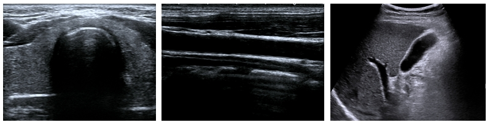
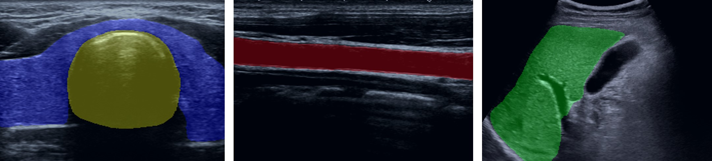

# Segmentation — Multi-Organ Real-time Segmentation


> UNet with reparameterizable convolution for real-time segmentation of thyroid, trachea, carotid artery and liver.

This module provides an inference implementation of a **UNet model with Reparameterizable Convolution blocks**, designed for multi-organ segmentation in ultrasound images (thyroid, carotid artery, trachea, liver). The model supports both **CUDA (GPU)** and **CPU** inference.

---

## Repository Structure

```
Segmentation/
├── model/
├── checkpoint/
├── input/
├── output/
├── Inference.py
└── README.md
```

---

## 📌 Pretrained Weights

Pretrained weights are provided on HuggingFace.

👉 **HuggingFace Model Hub**
https://huggingface.co/medaiming/UnetReparamConv

Download `best.pth` and place it into:
```
Segmentation/checkpoint/best.pth
```

---

## 🚀 Inference Usage

On our system, inference typically takes approximately 100–150 ms per image, including preprocessing, model inference, and postprocessing, corresponding to approximately 7–10 FPS. The actual runtime may vary depending on the GPU/CPU model, CUDA version, input image resolution, and system load.

### ⚡ CUDA Inference

```bash
python Inference.py \
    --weights checkpoint/best.pth \
    --img_path input/thyroid.png \
    --save_path output/thyroid.png \
    --device cuda
```

### 🖥️ CPU Inference

```bash
python Inference.py \
    --weights checkpoint/best.pth \
    --img_path input/thyroid.png \
    --save_path output/thyroid.png \
    --device cpu
```

---

## ⚙️ Parameters

| Argument       | Type   | Default                | Description |
|----------------|--------|------------------------|-------------|
| `--weights`    | str    | `checkpoint/best.pth`       | Model weights path |
| `--img_path`   | str    | `input/thyroid.png`    | Input ultrasound image |
| `--save_path`  | str    | `output/thyroid.png`   | Output overlay path |
| `--device`     | str    | `cuda`                 | Device: `cuda` or `cpu` |

---

## 🖼️ Visualization

### Input Image



### Output Image



---

## 🏥 Multi-Class Colors

| Label | Organ           | Color (B, G, R)  |
|-------|-----------------|------------------|
| 0     | Background      | Transparent      |
| 1     | Thyroid         | (255, 0, 0)      |
| 2     | Carotid artery  | (0, 0, 255)      |
| 3     | Trachea         | (0, 255, 255)    |
| 4     | Liver           | (0, 255, 0)      |

---

## Demo Video

You can refer to this video for a quick overview of the system's capabilities and usage.


https://github.com/user-attachments/assets/42a10968-a380-4209-8635-5ddea7e3e71f


---

## 📬 Contact

For issues or improvements, please open an Issue.
